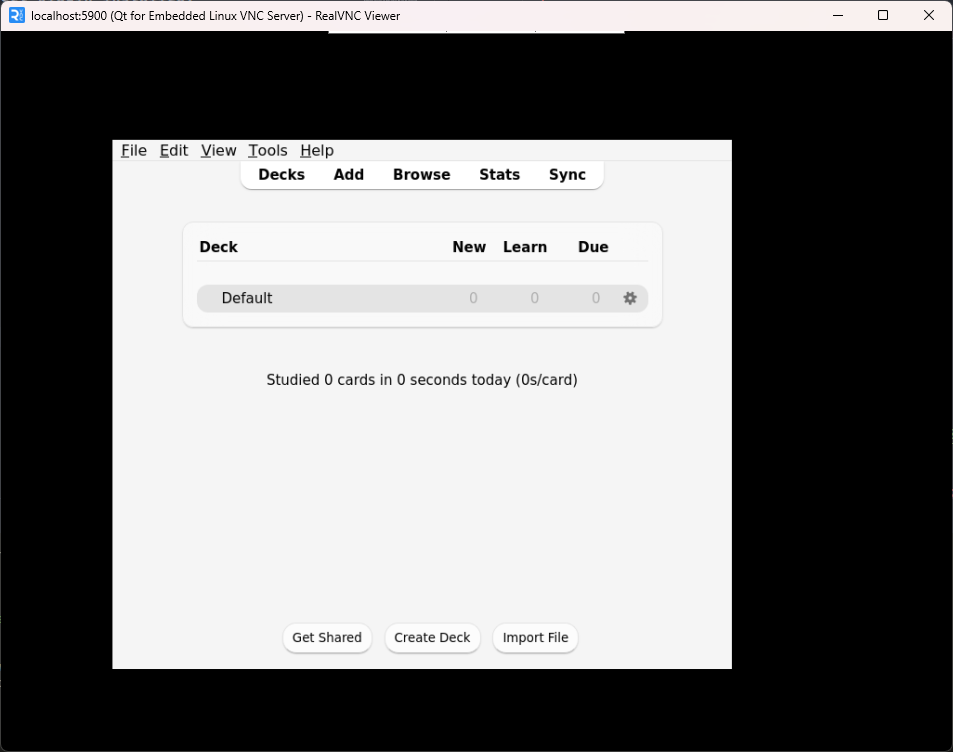

# Headless Anki
Headless Anki with the AnkiConnect plugin installed.  
Useful in automation workflows.

The default user profile is as barebones as it can get.

Creates the following volumes that can be further exposed by the user:
- `/data`: Anki data (Profile, decks etc.).
- `/export`: Path that can be used for exporting Anki decks, e.g. using the AnkiConnect API.

## Usage
To run, execute:
```bash
docker run -d -p 8765:8765 -v $(pwd)/export:/export thisisnttheway/headless-anki:latest
```

To bring your own Anki profile, mount it on `/data` in the container:
```bash
docker run -d -v ~/.local/share/Anki2:/data thisisnttheway/headless-anki:latest
```

> [!WARNING]
> Make sure that your AnkiConnect configuration doesn't have a listen address of `localhost`.

You can also use other QT platform plugins by setting the env var `QT_QPA_PLATFORM`:
```bash
docker run -e QT_QPA_PLATFORM="offscreen" ...
```

By default, Anki will be launched using `QT_QPA_PLATFORM="vnc"`.  
This will enable Anki to be accessed using a VNC viewer, provided port `5900` is forwarded:  


## Building
To quickly build the image, issue:
```bash
docker build --progress=plain . -t headless-anki:test
```

Different versions of each component (Anki, QT, AnkiConnect) can be installed.  
Supply these versions as build flags:
```bash
docker build --build-arg ANKI_VERSION=23.12.1 --build-arg QT_VERSION=6 --build-arg ANKICONNECT_VERSION=24.1.21.0 ...
```

For available versions, refer to [Ankis GitHub releases](https://github.com/ankitects/anki/releases).